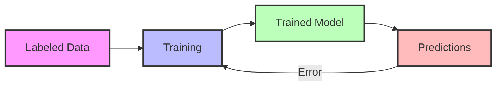
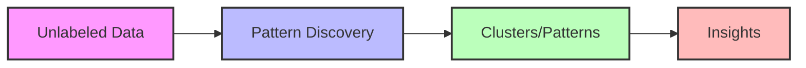

# Machine Learning Concepts

## Supervised Learning

Supervised learning is a type of machine learning where the algorithm learns from labeled training data. The process involves:

- **Input**: Labeled training data (features and their corresponding outputs)
- **Learning**: The algorithm learns patterns from the labeled data
- **Output**: The trained algorithm that can make predictions
- **Results**: Using the model to make predictions on new data
- **Feedback**: Error correction to improve the model's performance

### Process Flow
1. **Input Stage**: Start with labeled training data
2. **Learning Stage**: Train the model using the labeled data
3. **Output Stage**: Generate a trained model
4. **Results Stage**: Make predictions on new data
5. **Feedback Loop**: Use prediction errors to improve the model

### Common Applications
- Image Classification
- Spam Detection
- Speech Recognition
- Medical Diagnosis
- Credit Risk Assessment

## Unsupervised Learning

Unsupervised learning is a type of machine learning where the algorithm learns patterns from unlabeled data without explicit supervision.

- **Input**: Unlabeled data (raw features without predefined outputs)
- **Learning**: The algorithm discovers patterns and structures
- **Output**: Identified clusters, patterns, or relationships
- **Results**: Insights and data organization

### Process Flow
1. **Input Stage**: Start with unlabeled data
2. **Learning Stage**: Discover patterns and structures
3. **Output Stage**: Identify clusters or patterns
4. **Results Stage**: Extract insights and relationships

### Common Applications
- Customer Segmentation
- Anomaly Detection
- Topic Modeling
- Image Compression
- Market Basket Analysis

## Key Differences

| Aspect | Supervised Learning | Unsupervised Learning |
|--------|-------------------|---------------------|
| Data | Labeled | Unlabeled |
| Goal | Predict outcomes | Discover patterns |
| Feedback | Direct (labels) | Indirect (patterns) |
| Complexity | Higher | Lower |
| Use Cases | Classification, Regression | Clustering, Dimensionality Reduction |

## When to Use Each

### Supervised Learning
- When you have labeled data
- When you need to predict specific outcomes
- When accuracy is critical
- When you have a clear target variable

### Unsupervised Learning
- When you have unlabeled data
- When you want to discover patterns
- When you need to reduce data dimensions
- When you want to group similar items 